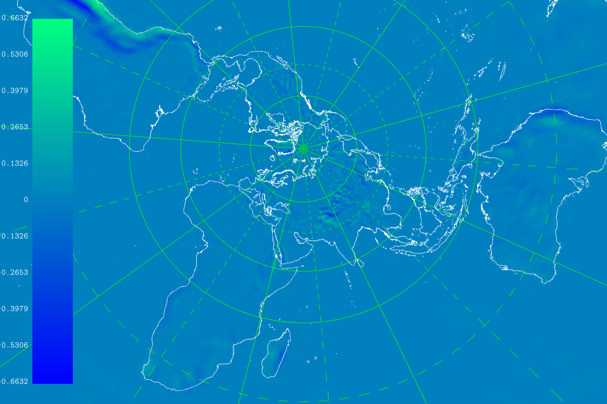

# spcm_simple.F90

Simplified SI scheme of ARPEGE/IFS.

# Building

This test case requires :

- https://github.com/pmarguinaud/fiat/tree/pginvtx+mplacc
- https://github.com/ecmwf-ifs/ectrans

Building for NVIDIA/PGI (edit Makefile.nvhpc first):

```
$ make ARCH=nvhpc
```

This will create nvhpc/spcm.x

Building for Intel (edit Makefile.intel):

```
$ make ARCH=intel
```

# Running

```
[CNC nvhpc]$ ./spcm.x --help
 PROGRAM: spcm.x
                                 --verbose =            FLAG                                                            
 
                            --write-grib-1 =            FLAG                                                            
 
                            --write-text-1 =            FLAG                                                            
 
                            --write-grib-2 =            FLAG                                                            
 
                            --write-text-2 =            FLAG                                                            
 
                                 --stat-gp =            FLAG                                                            
 
                                 --stat-sp =            FLAG                                                            
 
                                    --case =          STRING                                                            
 
FORTRAN STOP
```

The most important options are :

- --case : test case to use (directory containing data)
- --stat-gp : print statistics for validation

Example :

```
mpiauto --verbose -np 8 --wrap --wrap-stdeo -- ./intel/spcm.x --case t0031l015c2.4-008mpi --stat-gp
```

Please note that the test cases shipped with this test case have their number of MPI tasks hard wired, each MPI task
having its own data set. The number of MPI tasks is part of the test case name.

# Validating

The --stat-gp option will produce a listing such as :

```
            NAME   JLEV                            MAX                           MIN                           RMS
            PSPT      1     0.28421709430404007435E-13   -0.28421709430404007435E-13    0.40194366942304644268E-13
            PSPT      2     0.28421709430404007435E-13   -0.28421709430404007435E-13    0.40194366942304644268E-13
            PSPT      3     0.28421709430404007435E-13   -0.28421709430404007435E-13    0.63552874323130191813E-13
            PSPT      4     0.28421709430404007435E-13   -0.28421709430404007435E-13    0.40194366942304644268E-13
            PSPT      5     0.28421709430404007435E-13   -0.28421709430404007435E-13    0.69618685722138533303E-13
            PSPT      6     0.28421709430404007435E-13   -0.28421709430404007435E-13    0.69618685722138533303E-13
            PSPT      7     0.28421709430404007435E-13   -0.28421709430404007435E-13    0.69618685722138533303E-13
            PSPT      8     0.56843418860808014870E-13   -0.56843418860808014870E-13    0.20097183471152321503E-12
            PSPT      9     0.56843418860808014870E-13   -0.56843418860808014870E-13    0.16077746776921857707E-12
            PSPT     10     0.56843418860808014870E-13   -0.56843418860808014870E-13    0.12058310082691391387E-12
            PSPT     11     0.56843418860808014870E-13   -0.56843418860808014870E-13    0.13923737144427706661E-12
            PSPT     12     0.56843418860808014870E-13   -0.56843418860808014870E-13    0.80388733884609288536E-13
            PSPT     13     0.00000000000000000000E+00    0.00000000000000000000E+00    0.00000000000000000000E+00
            PSPT     14     0.00000000000000000000E+00    0.00000000000000000000E+00    0.00000000000000000000E+00
            PSPT     15     0.56843418860808014870E-13   -0.56843418860808014870E-13    0.12710574864626038363E-12
```

Such figures for temperature show that the results are quite well reproduced, the differences being quite small.

# Test cases

The following test cases are provided :

- t0031l015c1.0-001mpi
- t0031l015c1.0-001mpi+cor
- t0031l015c1.0-008mpi
- t0031l015c1.0-008mpi+cor
- t0031l015c2.4-001mpi
- t0031l015c2.4-008mpi
- t0107l070c1.0-008mpi
- t0149l105c1.0-008mpi

The first figure is the truncation, then comes the number of levels, the stretching factor, the number of tasks, and whether the Coriolis 
factor is taken into account in the calculations (+cor). Note that Coriolis related calculations are not possible with a non-trivial
stretching factor (ie != 1.0).

Some other (bigger) test cases are available on demand, but could not be included in the git repository.


# Temperature correction T149L105


